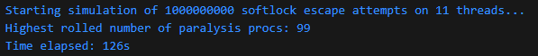

# Graveler Softlock Simulator

In response to [ShoddyCast's Video](https://www.youtube.com/watch?v=M8C8dHQE2Ro) on the subject, this is an improvement over Austin's [original implementation](https://github.com/arhourigan/graveler) of a simulator, which performs a billion attempts at escaping the Graveler softlock in 2-3 minutes, rather than a week.

Executing the program using Java 21, on a Ryzen 5 3600 Windows machine.
